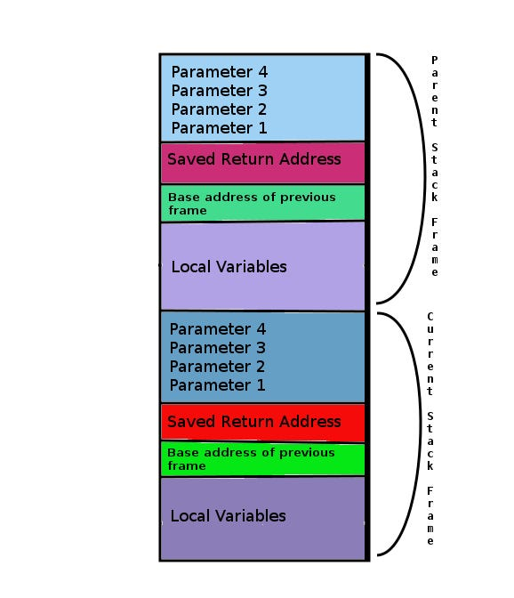

# **Understanding Buffer Overflows: Mechanisms, Exploitation, History, and Prevention**

*A Comprehensive Technical Guide for Cybersecurity Professionals, Software Engineers, and Systems Architects*

**Executive Summary:** Buffer overflow vulnerabilities have remained one of the most critical classes of software security bugs for over three decades. Occurring primarily in unmanaged low-level languages like C and C++, buffer overflows allow adversaries to manipulate program execution, corrupt memory, cause denial-of-service conditions, or execute arbitrary code. This report breaks down the inner workings of memory buffer overflows, walks through an illustrative exploitation scenario, analyzes key historical events, and outlines modern mitigation strategies.

## **1. Introduction & Significance in Computer Security**

In computer programming, a **buffer** is a contiguous block of allocated memory used to hold data temporarily as it moves from one region to another—such as user input stored in memory prior to processing. A **buffer overflow** (or buffer overrun) occurs when a program attempts to write more data to a buffer than the buffer's allocated capacity can hold.

Because low-level languages like C and C++ do not automatically enforce boundary checks on arrays or pointers, excess data bleeds beyond the buffer's boundary and overwrites adjacent memory addresses. In security contexts, this memory corruption presents severe consequences:

* **Arbitrary Code Execution (ACE):** Attackers can overwrite control structures—such as function return addresses or instruction pointers—redirecting program execution to malicious instructions (shellcode).  
* **Privilege Escalation:** If a vulnerable process runs with elevated privileges (e.g., root or SYSTEM), successful exploitation grants the attacker those same elevated system privileges.  
* **Denial of Service (DoS):** Overwriting vital control registers or data structures often leads to segmentation faults, process crashes, and service outages.  
* **Data Corruption & Confidentiality Breaches:** Overwriting neighboring variables can alter application logic, bypass authentication checks, or leak sensitive data held in adjacent buffers.

## **2. The Architecture of a Buffer Overflow**

To understand how a buffer overflow occurs, it is essential to examine the memory structure of a executing process, specifically the **call stack**.

### **Process Memory Layout**

When an operating system runs an executable, it divides the virtual address space into several key regions:

* **Text Segment:** Contains the executable machine instructions (read-only).  
* **Data / BSS Segments:** Hold global and static variables.  
* **Heap:** Dynamically allocated memory managed by functions like malloc() and free() (grows upward toward higher memory addresses).  
* **Stack:** Manages function call frames, local variables, and control flow pointers (grows downward toward lower memory addresses on standard x86/x64 architectures).

### **The Call Stack Frame**

When a function is called, a new **stack frame** is pushed onto the stack. A typical stack frame contains:

1. **Function Parameters:** Arguments passed into the function.  
2. **Saved Return Address (EIP/RIP):** The instruction memory address that the program must return to once the current function completes execution.  
3. **Saved Frame Pointer (EBP/RBP):** The pointer to the caller's stack frame base address.  
4. **Local Variables:** Buffers and local state variables allocated for the function.



### **The Overwrite Mechanism**

Because buffers allocated on the stack fill from *lower addresses toward higher addresses*, writing beyond the boundary of a local variable moves directly toward the saved frame pointer and the saved return address.

[Lower Memory Addresses]  
|-----------------------------------| <br>
|--- Local Buffer (e.g., 64 bytes) ---|  \<-- Data writing starts here and moves UP  
|-----------------------------------| <br>
| Saved Frame Pointer (EBP / RBP) |  \<-- Overwritten if buffer overflows  
|-----------------------------------| <br>
|- Saved Return Address (EIP / RIP) | \<-- Overwritten to hijack control flow\!  
|-----------------------------------| <br>
|------- Function Arguments ------| <br>
|-----------------------------------| <br>
[Higher Memory Addresses]

When functions use un-bounded string copy mechanisms—such as strcpy(), gets(), or sprintf()—they continue copying bytes until a null-terminator (\\0) is encountered, regardless of the target buffer's size.

## **3\. Simplified Exploitation Example**

Consider the following simplified C code containing a classic stack-based buffer overflow vulnerability:

```c
#include <stdio.h\>  
#include <string.h\>

void secret_function() {  
    printf("SUCCESS: Unauthorized access granted to restricted function\!\\n");  
}

void vulnerable_function(char *user_input) {  
    char buffer[64]; // Allocated space for 64 bytes  
      
    // VULNERABILITY: strcpy does not check if user_input fits into buffer  
    strcpy(buffer, user_input);   
      
    printf("Buffer contains: %s\n", buffer);  
}

int main(int argc, char *argv[]) {  
    if (argc > 1) {  
        vulnerable_function(argv[1]);  
    } else {  
        printf("Please supply an argument.\n");  
    }  
    return 0;  
}
```

### **Anatomy of the Attack**

1. **Normal Execution:** If the user supplies an input string under 64 bytes (e.g., "Hello"), strcpy() populates \`buffer\`, the function prints the output, cleans up the stack frame, and returns control to main().  
2. **Crafting the Payload:** An attacker supplies an input longer than 64 bytes. For instance, on a 32-bit architecture:  
   * 64 bytes of junk data (padding for the buffer).  
   * 4 bytes to overwrite the Saved Base Pointer (EBP).  
   * 4 bytes representing the target memory address of secret\_function() to overwrite the Return Address (EIP).  
3. **Control Hijacking:** When vulnerable\_function() reaches its ret (return) instruction, the CPU pops the saved return address off the stack into the Instruction Pointer register. Because that address was overwritten with the address of secret\_function(), execution immediately jumps to secret\_function(), executing code that was never intended to run.

## **4\. Historical Significance & Real-World Impact**

Buffer overflow vulnerabilities have shaped cybersecurity policy, operating system architecture, and modern programming standards. Below is a comparison of influential security incidents linked to memory boundary flaws:

| Event / Incident | Year | Vulnerability Type | Impact & Historical Significance   |
| :---- | :---- | :---- | :---- |
| **The Morris Worm** | 1988 | Stack Buffer Overflow (in UNIX fingerd daemon) | The first widespread worm on the Internet. It exploited a buffer overflow in gets() inside the fingerd protocol, infecting thousands of Unix systems and prompting the creation of the CERT Coordination Center. |
| **SQL Slammer Worm** | 2003 | Stack Buffer Overflow (Microsoft SQL Server) | A 376-byte UDP packet exploited an un-bounded buffer in ssnetlib.dll. It infected over 75,000 servers in 10 minutes, severely slowing global Internet traffic and crashing critical infrastructure. |
| **Heartbleed Bug** | 2014 | Buffer Over-read (OpenSSL Heartbeat Extension) | While technically a *buffer over-read* rather than an overwrite, Heartbleed stemmed from missing bounds checks. It allowed remote attackers to read up to 64KB of server memory per request, leaking private SSL/TLS keys and user passwords globally. |

## **5\. Practical Methods for Risk Reduction and Safeguards**

Protecting software against buffer overflow vulnerabilities requires a defense-in-depth approach spanning code hygiene, compiler protections, and operating system controls.

### **A. Secure Coding Practices**

* **Replace Vulnerable Functions:** Deprecate unsafe C/C++ string functions in favor of length-bounded equivalents:  
  * Avoid strcpy(), strcat(), gets(), and sprintf().  
  * Use strncpy(), strncat(), fgets(), and snprintf() with explicit size limits.  
* **Strict Bounds Checking:** Always validate array indexes and pointer offsets before writing to dynamic or static memory buffers.  
* **Adopt Memory-Safe Languages:** Modern applications should leverage memory-safe languages such as **Rust, Go, Java, Python, or Swift**, which feature automatic memory management and runtime boundary checks, eliminating spatial memory safety bugs by design.

### **B. Compiler and Operating System Mitigations**

| Mitigation Technique | Mechanism | Security Benefit   |
| :---- | :---- | :---- |
| **Address Space Layout Randomization (ASLR)** | Randomizes the memory locations of the stack, heap, and libraries on every program execution. | Prevents attackers from reliably predicting target memory addresses for return instructions or shellcode. |
| **Data Execution Prevention (DEP / NX)** | Marks memory regions (like stack and heap) as Non-Executable (NX). | Prevents injected malicious code placed on the stack or heap from executing. |
| **Stack Canaries (Stack Smashing Protection)** | Inserts a random secret integer value on the stack between local buffers and the saved return address. | Before returning, the function checks if the canary value was altered; if changed, the program immediately aborts execution. |
| **Control Flow Integrity (CFI)** | Checks valid target destinations for indirect calls and returns at runtime. | Blocks execution if control flow jumps to an unexpected or illegal location. |

### **C. Security Testing & Analysis**

* **Static Application Security Testing (SAST):** Static code analyzers detect unsafe function usage and missing boundary validations during development.  
* **Dynamic Analysis & Fuzzing:** Tools like AFL (American Fuzzy Lop) and libFuzzer feed randomized, malformed input into applications to detect memory corruption crashes before deployment.

## **6\. Conclusion**

Buffer overflows demonstrate how low-level memory handling errors can escalate into system-wide security breaches. While modern hardware and compilers provide robust mitigation layers like ASLR, DEP, and Stack Canaries, reliance on legacy C/C++ codebases ensures that memory security remains a paramount concern. By pairing secure coding standards with modern compiler defenses and automated fuzz testing, developers can effectively mitigate buffer overflow risks and build resilient software systems.